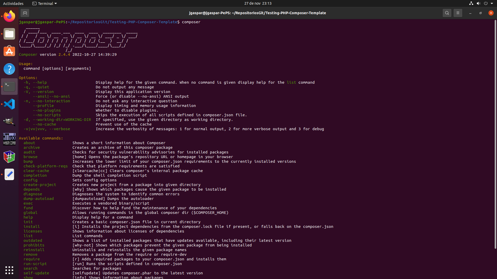

# Testing-PHP-PHPUnit-Composer-Template
Plantilla entorno de prueba PHP-Composer y Testing con PHPUnit.
<p align="center">
    <a href="https://getcomposer.org/">
        
    </a>
</p>
Composer te ayuda a declarar, gestionar, e instalar dependencias de proyectos PHP.

 Ver https://getcomposer.org/ para más información y documentación.

## Instalación Composer en el sistema operativo Ubuntu:
``` bash
# Actualizar repositorios.
sudo apt-get update
# Instalar Composer en el sistema operativo.
sudo apt-get install composer -y
```
## Instalación PHPUnit
``` bash
# Instalar Composer en el sistema operativo.
sudo apt-get install phpunit -y
```

## Listado de comandos disponibles en Composer
``` bash
composer list
```


## Creación del paquete comoposer.json

Crea un fichero basico de configuración *composer.json* en el directorio actual.

``` bash
# Crea un fichero basico de configuración en el directorio actual.

composer init
```

## Instalación

``` bash
# Instalar dependencias
composer install
```

## Test

``` bash
composer test
```
## Instalación de PHP 8.1.4

### Actualizar el Sistema Operativo

``` bash
sudo apt update && sudo apt upgrade -y
```
### Incluir nuenvo repositorio para PHP 8

``` bash
# Añadimos un nuevo repostorio
sudo apt install software-properties-common && sudo add-apt-repository ppa:ondrej/php -y

# Actualizamos la lista de repositorios APT
sudo apt update

# A continuación actualizaremos los paquetes que así lo requieran
sudo apt upgrade -y
```

### Instalar el módulo Apache

``` bash
# Instalación de PHP 8.1 con el módulo Apache 2
sudo apt install php8.1 libapache2-mod-php8.1

# Reiniciamos el servidor Apache para que cargue el módulo de nuevo.
sudo systemctl restart apache2

# Comprobamos la versión de PHP instalada
php -- version
```

### Actualización de Composer
``` bash
#!/bin/bash
# Eliminamos la instalación de composer previa
sudo apt-get remove composer -y
```
Descargar e instalar composer

``` bash
sudo su

php -r "copy('https://getcomposer.org/installer', 'composer-setup.php');"
php composer-setup.php --install-dir=/usr/bin --filename=composer

# Comprobamos que se ha instalado la ultima versión de composer
composer
```


## Referencias:
- [PHP](https://www.php.net/).
- [PHP Unit](https://phpunit.de/).
- [Composer](https://getcomposer.org/).
- [Cómo instalar PHP 8.1 sobre Ubuntu 20.04](https://es.linuxcapable.com/how-to-install-php-8-1-on-ubuntu-20-04/).
- [Actualizar Composer en Ubuntu](https://techvblogs.com/blog/update-composer-in-ubuntu).
- [Composer: Dependency manager to PHP](https://github.com/composer/composer).
